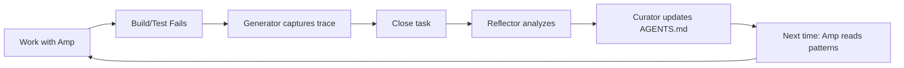

# Easy ACE Framework Installation

## One-Command Setup

From this repository, run:

```bash
./scripts/create-ace-starter.sh /path/to/your-project
```

That's it! The framework is installed and ready.

## What It Does

The script:
1. ✅ Creates `agents/`, `mcp/`, `logs/`, `scripts/` directories
2. ✅ Copies all ACE framework files
3. ✅ Creates `AGENTS.md` with learning sections
4. ✅ Sets up TypeScript config
5. ✅ Installs dependencies
6. ✅ Initializes Beads tracking
7. ✅ Builds everything

## Manual Installation (5 commands)

If you prefer manual setup:

```bash
cd your-project

# 1. Copy framework files
git clone https://github.com/yourusername/ace-framework-minimal /tmp/ace
cp -r /tmp/ace/agents /tmp/ace/mcp /tmp/ace/scripts .
mkdir -p logs && touch logs/{execution_traces,insights}.jsonl

# 2. Install dependencies
npm install --save-dev typescript @types/node tsx
npm pkg set type="module"
npm pkg set scripts.build="tsc"

# 3. Initialize
bd init  # If you have Beads installed

# 4. Create AGENTS.md
curl -o AGENTS.md https://raw.githubusercontent.com/yourusername/ace-framework-minimal/main/AGENTS.md.template

# 5. Build
npm run build
```

## First Use

After installation:

```bash
# Create a task
bd create "Test ACE framework" -t task -p 1

# Work on it (using Amp)
amp "Work on the highest priority bead"

# When done, trigger learning
npm run ace-learn

# Check what was learned
tail AGENTS.md
```

## What You Get

### File Structure
```
your-project/
├── agents/
│   ├── Generator.ts      # ← Captures execution traces
│   ├── Reflector.ts      # ← Analyzes patterns
│   └── Curator.ts        # ← Updates knowledge
├── mcp/
│   ├── types.ts
│   └── beads-client.ts   # ← Auto-triggers learning
├── scripts/
│   └── ace-learn-cycle.ts # ← Reflector → Curator pipeline
├── logs/
│   ├── execution_traces.jsonl
│   └── insights.jsonl
└── AGENTS.md              # ← Your growing knowledge base
```

### New Commands
```bash
npm run build      # Build TypeScript
npm run ace-learn  # Run learning cycle manually
```

### Automatic Learning

When using BeadsClient to close tasks:
```typescript
import { BeadsClient } from './mcp/beads-client.js';

const client = new BeadsClient();
await client.closeIssue('ACE_Beads_Amp-42', 'Completed');
// ↑ Automatically runs Reflector → Curator → updates AGENTS.md
```

## How It Works



### Example Learning Cycle

1. **You work:**
   ```bash
   amp "Add a user login function"
   ```

2. **Build fails:**
   ```
   Error: Cannot find module './auth.js'
   ```

3. **Generator captures:**
   ```json
   {
     "tool": "tsc",
     "message": "Cannot find module './auth.js'",
     "file": "src/index.ts"
   }
   ```

4. **You close task:**
   ```typescript
   await client.closeIssue('ACE_Beads_Amp-42', 'Fixed imports');
   ```

5. **Reflector analyzes:**
   ```json
   {
     "pattern": "TypeScript ESM imports need .js extension",
     "confidence": 0.95
   }
   ```

6. **Curator updates AGENTS.md:**
   ```markdown
   [Bullet #abc123, helpful:0, harmful:0] TypeScript module imports require .js extension even for .ts files - Always use .js extensions in import statements
   ```

7. **Next time:**
   Amp reads AGENTS.md and knows to use `.js` extensions!

## Dependencies

**Required:**
- Node.js (v18+)
- npm

**Recommended:**
- [Beads CLI](https://github.com/steveyegge/beads) for task tracking
- [Amp](https://ampcode.com) for AI coding

**Optional:**
- Git (for hooks)

## Configuration

### Customize Learning Threshold

Edit `scripts/ace-learn-cycle.ts`:

```typescript
// Line 25: Change confidence threshold (default 0.8)
const deltas = await curator.processInsights(0.9); // More strict

// Line 22: Change max patterns per session (default 3)
const curator = new Curator(insightsPath, agentsPath, 5);
```

### Add Custom Pattern Categories

Edit `AGENTS.md`:

```markdown
### API Patterns
<!-- Curator adds API insights here -->

### Security Patterns
<!-- Curator adds security insights here -->
```

Then update `agents/Curator.ts` to route insights to these sections.

## Troubleshooting

### Build fails with "Cannot find module"

Make sure you're using `.js` extensions in imports:
```typescript
// ✅ Correct
import { Generator } from './agents/Generator.js';

// ❌ Wrong  
import { Generator } from './agents/Generator';
```

### No patterns being learned

Check if execution traces are being created:
```bash
cat logs/execution_traces.jsonl
```

If empty, the Generator isn't capturing failures. You may need to manually call `Generator.recordExecution()` when builds/tests fail.

### "Section not found" errors

Make sure AGENTS.md has the exact section headers:
```markdown
### Build & Test Patterns
### TypeScript Patterns
### Dependency Patterns
### Architecture Patterns
```

## Uninstall

To remove ACE framework:

```bash
rm -rf agents/ mcp/ scripts/ace-learn-cycle.ts logs/*.jsonl
# Optionally remove learning sections from AGENTS.md
```

## Upgrading

To update to latest ACE framework:

```bash
# Re-run the installer
./scripts/create-ace-starter.sh /path/to/your-project

# Your AGENTS.md and logs are preserved
```

## Learn More

- 📖 [Full Integration Guide](INTEGRATION_GUIDE.md)
- 📄 [ACE Research Paper](https://arxiv.org/html/2510.04618v1)
- 🔵 [Beads Documentation](https://github.com/steveyegge/beads)
- 🤖 [Amp Manual](https://ampcode.com/manual)

## Getting Help

Questions or issues? Check:
1. Is TypeScript building? `npm run build`
2. Are traces being captured? `cat logs/execution_traces.jsonl`
3. Is AGENTS.md properly formatted? Check section headers

## What's Next?

After installation:
1. ✅ Complete your first task
2. ✅ See patterns appear in AGENTS.md
3. ✅ Notice Amp improving on subsequent tasks
4. ✅ Enjoy the learning loop!

The framework improves as you work. After 10-20 tasks, you should see measurable improvement in Amp's coding quality.
